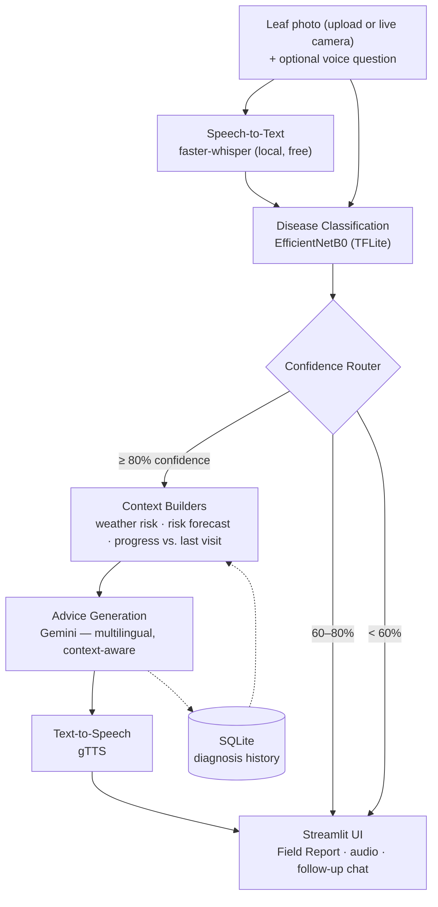

<div align="center">

# Crop Disease Voice Assistant
### Voice-First Crop Disease Diagnosis for Smallholder Farmers

Photo/Voice → CV Diagnosis → Confidence Router → Weather & Progress-Aware Advice → Spoken Response

[](https://www.python.org/)
[](https://streamlit.io/)
[](https://www.tensorflow.org/)
[](https://ai.google.dev/)
[](https://render.com)

[Live Demo](https://crop-disease-voice.onrender.com) · [How It Works](#how-it-works) · [Quick Start](#quick-start) · [Deployment](#deployment) · [Known Gaps](#known-gaps)

</div>

---

## What it does

A farmer uploads or photographs a crop leaf, optionally asks a question out loud, and the app:

1. **Classifies the disease** using a fine-tuned EfficientNetB0 model (38 classes across 14 crops, trained on PlantVillage, 96.2% validation accuracy)
2. **Routes on confidence, honestly** — high confidence gets a full diagnosis, medium confidence asks for a clearer photo, low confidence flags the case for expert review instead of guessing
3. **Builds context** — current weather risk, a 3-day forward-looking disease-risk forecast, and whether this same disease was seen on a prior visit
4. **Generates farmer-facing advice** via Gemini — organic and chemical treatment options, in the farmer's chosen language, aware of the weather/progress context above
5. **Speaks the response aloud** via text-to-speech, and supports a grounded follow-up conversation, typed or by voice
6. **Logs every diagnosis** for progress tracking across future visits

---

## How It Works



**Why the confidence router matters:** most consumer plant-diagnosis apps always return a confident-sounding answer. This one doesn't — below 80% confidence it asks for a better photo or flags the case for a human expert instead of guessing.

---

## Features

| | |
|---|---|
| 🎙️ **Voice-first** | Ask a question by voice, hear the diagnosis and advice spoken back — no reading required |
| 📷 **Live camera or gallery upload** | Take a photo directly in-app, or upload one — no separate camera app needed |
| 🎯 **Honest confidence-tier routing** | High/medium/low tiers, not a single always-confident output |
| 🌦️ **Weather-aware advice** | Current conditions plus a forward-looking 3-day disease-risk forecast, factored directly into the spoken advice |
| 📋 **Progress tracking** | Compares today's diagnosis to the last time the same disease was logged, and says whether it looks better, worse, or the same |
| 🗣️ **Grounded follow-up conversation** | Ask questions about your diagnosis, typed or by voice |
| 📚 **Disease reference library** | Browse symptoms/prevention for all 38 trained classes without uploading a photo |
| 🧪 **Fertilizer calculator** | N-P-K estimate by crop, growth stage, and land area |
| 🔊 **9-language support** | English, Hindi, Marathi, Telugu, Tamil, Bengali, Kannada, Gujarati, Punjabi |
| 🆓 **Zero-cost stack** | Every service used (model hosting, LLM, weather, TTS/STT, deploy) has a genuine free tier |

---

## Tech Stack

| Layer | Choice |
|---|---|
| Vision model | EfficientNetB0, two-stage transfer learning (frozen → fine-tuned), trained on PlantVillage (38 classes), exported to TFLite for CPU inference |
| Speech-to-text | [faster-whisper](https://github.com/SYSTRAN/faster-whisper) — local, free, no API cost |
| Advice generation | Google Gemini (`google-genai` SDK) — multilingual, weather- and progress-aware prompting |
| Text-to-speech | gTTS |
| UI | Streamlit, with a custom design system (`app/ui_theme.py`) |
| History & progress tracking | SQLite |
| Weather | [OpenWeatherMap](https://openweathermap.org/) free tier (current conditions + 5-day/3-hour forecast) |
| Deployment | Docker on [Render](https://render.com) (free Web Service) |

---

## Quick Start

### 1. Train the model (Google Colab — free GPU)

```
Runtime → Change runtime type → T4 GPU
```
Copy `training/train_disease_model.py` into a cell and run it (~30–45 min). Download the resulting `crop_disease_model.tflite` and `class_names.json` into `app/models/`.

### 2. Run locally

```bash
python -m venv venv
source venv/bin/activate       # Windows: venv\Scripts\activate
pip install -r requirements.txt

cp .env.example .env           # set GEMINI_API_KEY (required), OPENWEATHER_API_KEY (optional)

streamlit run streamlit_app.py
```
Opens at `http://localhost:8501`. No trained model yet? **Demo mode** (auto-enabled when `app/models/` is empty) runs the full flow — including real Gemini advice and real TTS — against a fake diagnosis, so you can test everything else first.

### 3. Run with Docker

```bash
docker build -t crop-disease-voice .
docker run -p 7860:7860 --env-file .env crop-disease-voice
```

### Environment variables

| Variable | Required | Purpose |
|---|---|---|
| `GEMINI_API_KEY` | Yes | Advice generation and follow-up conversation |
| `OPENWEATHER_API_KEY` | No | Weather risk note + forecast; app runs fine without it, the weather card just doesn't show |

### Running tests

```bash
pytest tests/ -v
```
Fully mocked — runs without a trained model, a live Gemini key, or network access.

---

## Deployment

The live demo runs entirely on Render's free tier:

| Service | Provider | Why |
|---|---|---|
| Compute | [Render](https://render.com) (free Web Service, Docker) | Native Docker support, no card required; sleeps after 15 min idle, wakes on request |
| Secrets | Render environment variables | `GEMINI_API_KEY` / `OPENWEATHER_API_KEY`, never committed to git |

To deploy your own copy: fork the repo, create a Render **Web Service** pointed at your fork (Docker runtime, auto-detected from the included `Dockerfile`), add the two environment variables above, and deploy.

---

## Known Gaps

Being upfront about what's not built or not production-hardened yet:

- **History doesn't survive a redeploy** — Render's free tier has no persistent disk, so `storage/history.db` resets whenever the container restarts. Progress tracking works within a running instance's lifetime, not permanently. Fix: Render's paid disk add-on, or an external free-tier DB (e.g. Supabase).
- **No on-device/offline inference** — the model is already exported to TFLite, but there's no client-side (mobile/edge) integration path yet, only server-side.
- **"Community sightings" is not GPS-based** — it counts how often this app has logged the same diagnosis class recently, not a verified geographic radius. Framed honestly in the UI as "logged by other users of this app."

## Project Layout

```
crop_disease_voice/
├── training/
│   └── train_disease_model.py     # Run on Google Colab (free GPU)
├── app/
│   ├── services/
│   │   ├── disease_detection.py   # Loads TFLite model, runs inference
│   │   ├── response_router.py     # Confidence-tier routing
│   │   ├── speech_to_text.py      # faster-whisper
│   │   ├── advice_generation.py   # Gemini — advice + follow-up conversation
│   │   ├── text_to_speech.py      # gTTS
│   │   ├── weather.py             # OpenWeatherMap — current + forecast risk
│   │   ├── history_store.py       # SQLite — diagnosis log + progress tracking
│   │   └── fertilizer_calculator.py
│   ├── data/
│   │   └── disease_library.py     # Static reference data for all 38 classes
│   ├── ui_theme.py                # Design system (CSS + HTML component helpers)
│   └── models/                    # Trained model files go here
├── tests/                         # Mocked — no model/API key/network required
├── streamlit_app.py                # Main app
├── Dockerfile
└── requirements.txt
```

## License

MIT
