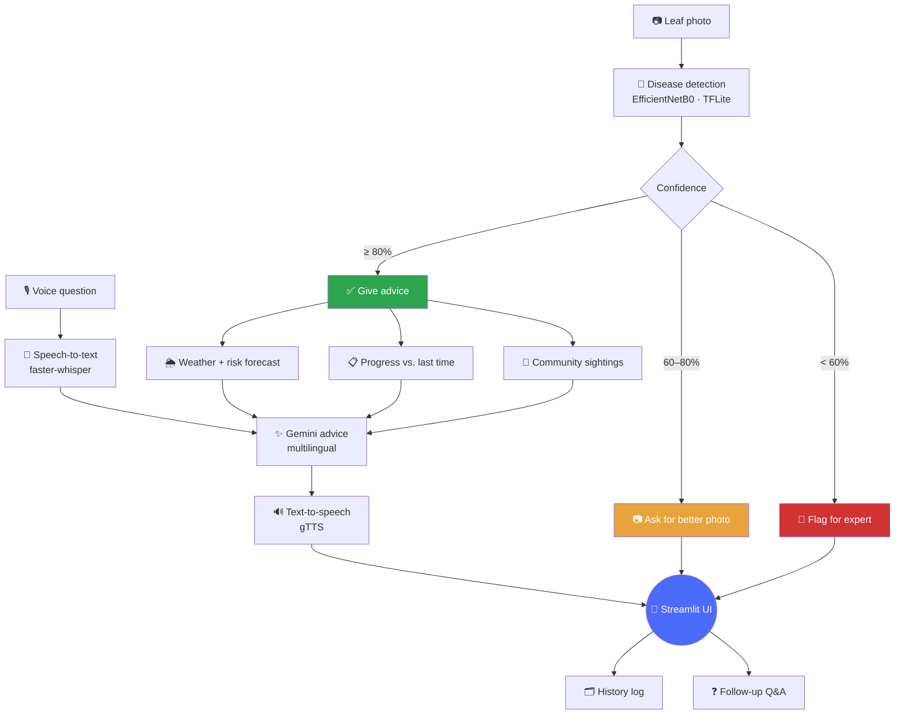

<div align="center">

# 🌾 Crop Disease Voice Assistant

### Point your phone at a sick leaf. Get spoken advice in your own language.

[](https://crop-disease-voice.onrender.com/)


**[👉 Try it live](https://crop-disease-voice.onrender.com/)** — no signup, works on your phone

</div>

---

No internet-scale dataset of labeled farmer photos, no funding, no GPU
server — just free tiers, stitched together honestly. This is what that
looks like when it actually works end to end.

## ✨ What it does

| | |
|---|---|
| 📷 **Snap or upload a leaf photo** | Camera or gallery, whichever's easier in the field |
| 🧠 **Get a real diagnosis** | EfficientNetB0 model, 38 disease classes across 14 crops |
| 🎯 **Trust the confidence, not just the answer** | Below 80%? It says so — asks for a better photo or flags an expert, instead of guessing |
| 🗣️ **Hear the advice, in your language** | Hindi, Marathi, Telugu, Tamil, Bengali, Kannada, Gujarati, Punjabi, English |
| 🌦️ **See disease risk before symptoms hit** | 3-day forward-looking weather forecast for fungal-risk conditions |
| 📋 **Track whether treatment is working** | Compares today's diagnosis against your last one for the same crop |
| ❓ **Ask follow-up questions** | Typed or spoken, grounded in your actual diagnosis |
| 📚 **Browse a free disease library** | All 38 classes, symptoms + prevention, no photo required |
| 🧪 **Estimate fertilizer needs** | N-P-K by crop, growth stage, land area |

## 🖼️ See it in action

> Diagnosis in Marathi, with live weather risk and a 3-day forecast:


*(Drop your own screenshots into `/screenshots` — GitHub renders them automatically once pushed.)*

## 🧭 How it all fits together



## 🎯 Why confidence tiers matter

Most tools give you a confident-sounding answer no matter what. This one doesn't:

```
≥ 80% confidence   →  ✅ Full diagnosis + spoken advice
60–80% confidence  →  📷 "Can you retake that photo?"
< 60% confidence   →  🚩 "This needs a human expert"
```

A low-confidence guess dressed up as certainty is worse than no answer at
all when someone's acting on it in a real field.

## 🚀 Quick start

```bash
git clone <this-repo>
cd crop_disease_voice
pip install -r requirements.txt
cp .env.example .env      # add your free GEMINI_API_KEY → aistudio.google.com/apikey
streamlit run streamlit_app.py
```

**No trained model yet?** Tick **Demo mode** in the sidebar. It runs the
*entire* flow — photo → diagnosis → real Gemini advice → real voice output
→ real follow-up chat — against a fake diagnosis, so you can build and test
everything else while training runs.

**Want to train your own model?** `training/train_disease_model.py` trains
an EfficientNetB0 on PlantVillage (38 classes, 14 crops) on a **free Colab
T4 GPU** in ~30–45 minutes — dataset auto-downloads, no Kaggle account needed.

## 🗂️ Project structure

```
crop_disease_voice/
├── streamlit_app.py                    # Diagnose · Library · Fertilizer tabs
├── Dockerfile                          # Deployed to Render, free tier
├── requirements.txt
├── training/
│   └── train_disease_model.py          # Free Colab GPU training script
├── app/
│   ├── ui_theme.py                     # Custom CSS + HTML card helpers
│   ├── services/
│   │   ├── disease_detection.py        # Model loading + inference
│   │   ├── response_router.py          # Confidence-tier routing
│   │   ├── speech_to_text.py           # faster-whisper (local, free)
│   │   ├── advice_generation.py        # Gemini advice + follow-up chat
│   │   ├── text_to_speech.py           # gTTS, 9 languages
│   │   ├── voice_pipeline.py           # End-to-end orchestration
│   │   ├── weather.py                  # Current + 3-day risk forecast
│   │   ├── fertilizer_calculator.py    # N-P-K estimates
│   │   └── history_store.py            # History, progress, community notes
│   ├── data/
│   │   └── disease_library.py          # 38-class symptom/prevention reference
│   └── models/                         # Trained model files live here
└── tests/
```

## ☁️ Deployment

Live on [Render](https://render.com) (free tier) via Docker — full
walkthrough in [`DEPLOYMENT.md`](./DEPLOYMENT.md). `GEMINI_API_KEY` and the
OpenWeatherMap key are read from environment secrets — never hardcoded,
never committed.

## ✅ What's built vs. what's not

<table>
<tr><td valign="top">

**Built**
- ✅ Confidence-tiered CV diagnosis
- ✅ Voice in, voice out, 9 languages
- ✅ Grounded follow-up conversation
- ✅ Weather + 3-day disease-risk forecast
- ✅ Progress tracking vs. past diagnoses
- ✅ App-wide community sightings note
- ✅ Live camera capture
- ✅ Disease reference library
- ✅ Fertilizer calculator

</td><td valign="top">

**Deliberately not built**
- ❌ Agmarknet mandi price lookup
- ❌ Government scheme pointer
- ❌ True GPS-based outbreak mapping
- ❌ Farmer community forum
- ❌ Offline on-device inference
- ❌ History persistence across redeploys

</td></tr>
</table>

> **Honesty note on "community sightings":** this counts how many other
> diagnoses of the same class were logged app-wide in the last 14 days.
> It's not GPS-based — it tells you how often *this app* has seen the
> diagnosis recently, not what's happening near you specifically.

## 🐛 Known issue — confidence bar renders as raw HTML

The field-report confidence bar in `app/ui_theme.py` can print literal
`<div>` tags instead of a styled bar. Cause: the HTML helper returns an
**indented** multi-line string, and Streamlit's Markdown parser reads 4+
space indentation as a fenced code block before the HTML is ever parsed.

**Fix:** return single-line, unindented HTML from every helper in that file
(`field_report_html`, `banner_html`, `step_html`, `tag_pill_html`).

## 📄 License

MIT

---

<div align="center">

Built step by step, on free tiers, for people who need it to just work in the field.

</div>
